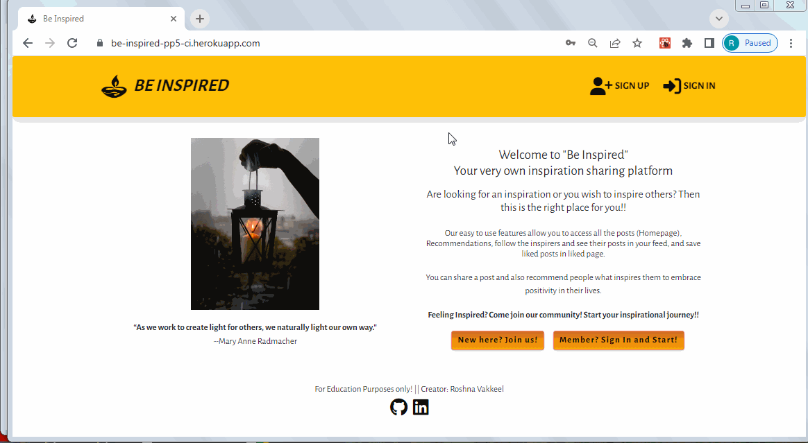
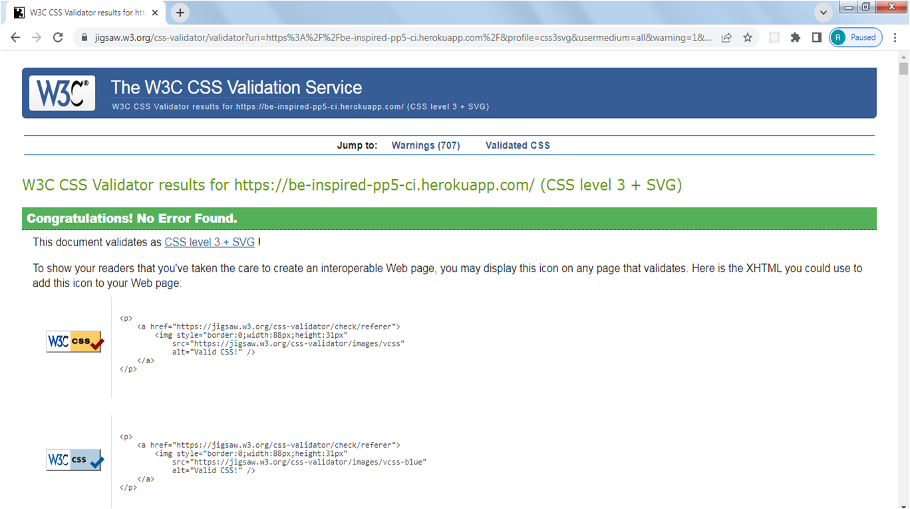

# Welcome to **[Be Inspired (PP5 CI)](https://be-inspired-pp5-ci.herokuapp.com/)**

## PERSPECTIVE
The main inspiration behind this App is - "If You Light A Lamp For Someone Else It Will Also Brighten Your Path"- Buddha.
The main motive is to be inspired and to spread positivity around. The attempt of the project is to create a social media App to connect like minded people who wish to look at the bright side and can also spread positivity to those who seek it.

## Links to Repositories and Live Sites

[Live site for the Front End](https://be-inspired-pp5-ci.herokuapp.com/)

[Live site for the Back End](https://be-inspired-drf-api.herokuapp.com/)

[Back End Respository](https://github.com/RoshnaVakkeel/be-inspired-drf-api)

## [Contents](#contents)
- [User Experience (UX)](#user-experience-ux)
	- [Site Goals](#site-goals)
	- [User Personas](#user-personas)
	- [Scope](#scope)
- [Agile Methodology](<#agile-methodology>)
    - [Epics and User Stories](<#epics-and-user-stories>)
        - [Website UI](<#website-ui>)
        - [Authentication](<#authentication>)
		- [Main page Layout](<#main-page-layout>)
		- [Post Management](<#post-management>)
        - [Recommendation Management](<#recommendation-management>)
        - [Comment Management](<#comment-management>)
        - [Likes Management](<#likes-management>)
        - [Profile Management](<#profile-management>)
    - [Acceptance Criteria](<#acceptance-criteria>)
	- [Tasks](<#tasks>)
	- [User Story Management](<#user-story-management>)
        - [Sprints](#sprints)
- [Design](<#design>)
	- [Colours](<#colours>)
	- [Typography](<#typography>)
	- [Imagery](<#imagery>)
	- [Wireframes](<#wireframes>)
- [Features](<#features>)
- [Components](<#components>)
- [Technologies](<#technologies>)
	- [Languages Used](<#languages-used>)
	- [Tools](<tools>)
	- [Frameworks, Libraries and Programs](<#frameworks-libraries-and-programs>)
- [Production](#production)
- [Issues and Fixes](<#issues-and-fixes>)
- [Testing](<#testing>)
	- [User Story Testing](<#user-story-testing>)
	- [Testing Technologies](<#testing-technologies>)
	- [Manual Testing](<#manual-testing>)
	- [Validation](<#validation>)
	- [Browser Compatibility](<#browser-compatibility>)
- [Deployment](<#deployment>)
	- [Heroku](<#heroku>)
- [Credits and Resources](<#credits-and-resources>)
	- [Code](<#code>)
	- [Learning Resources](<#learning-resources>)
	- [Content](<#content>)
	- [Media](<#media>)
- [Acknowledgements](<#acknowledgements>)


## User Experience (UX)

### Site Goals
- "Be Inspired" is a social media App mainly meant for everyone who is looking to socialize and share their positive and inspirational thoughts with others.
- Basic goal is to uplift morale and provide users with a happy mood.
- To enable users to share photos, their inspiration and recommendations
- To enable users to network using this social media platform
- All users who sign up and sign in, can access all the features of the website and can create, edit, and delete their posts/recommendations.
- People can post about their inspirations and also can recommend others about the inspirations that helped them.

### User Personas
As mentioned in Site Goals, the users expected to be visiting this website regularly are going anyone seeking positive motivation or inspiration to tackle/take on challenges in their lives. I created 4 fictional characters which represents the target users. The user personas with their needs, goals and frustrations are enlisted, which helped me design this website with a point of view of distinct users.
The link to User Personas can be found [here](docs/agile/user_personas.pdf).

### Scope

- An attractive and intuitive UX experience: 
	1. Website title that gives an idea what is it about
	2. Hero-image with information on the site's purpose
	3. Responsive design across all devices
	4. A clear and straightforward layout
	5. Footer fixed at the bottom with links to social media only in landing page
	6. Implement alert messages to provide users with more feedback after they take certain actions
	7. Fast application that is easy to use
	8. Show user's profile image in the profile section

- An easy navigation for the user through all the pages and features
	1. Navigation Menu with easy access to all links.
	2. Easy Sign Up/ Sign In/ Sign Out functionality visible.
	3. Posts list with infinite scroll feature
	4. Landing page with guidance to sign up/sign in and how to start using the websites features
	6. Search field to enable user to search a keyword
	7. Category filter for easy sorting of posts / recommendations
	8. User's Feed page with posts and recommendations from their favourite users
	9. Liked page to enable users to save the posts they liked

- Posts and Recommendation Features
	1. Latest entries feature on top or first
	2. On a click they can view post/ recommendation details
	3. Ability to comment on posts / recommendations
	4. Create, Edit and Delete posts and recommendations

- Profiles Features
	1. Shows username and Avatar, enlists posts and recommendations made by the user
	2. Shows information on Followers and other users following
	3. Password change option
	4. Profile edit option

[Back to top ⇧](#contents)

## Agile Methodology
Throughout this project, an agile approach was taken in order to develop the website  Each activity was broken down into  manageable actions from initially creating 4 Epics, which were then broken down into smaller User Stories. Each of the user stories then had different acceptance criteria. The status, comments and details of each Epic along with the associated User Stories can be found in the kanban board linked [here](https://github.com/users/RoshnaVakkeel/projects/3). This made the overall project much more manageable to build. 

## Epics and User Stories
8 Epics were created which were further developed into 37 User Stories. The initial conception was done using google sheets. The link can be found [here](docs/agile/epics_and_user_stories_list_be_inspired.xlsx).

### [Website UI](https://github.com/RoshnaVakkeel/be-inspired-pp5-ci/issues/1)

**Epic Goals for End User**

1. A landing page that describes the purpose of the website
2. User guidance to get started 
3. An easy to use navigation 
4. Easy register/sign up and sign in options
5. Home page with posts list with infinite scroll  visible to all

**Related User Stories**
1. [USER STORY US01: Intuitive Landing Page](https://github.com/RoshnaVakkeel/be-inspired-pp5-ci/issues/2)
2. [USER STORY US02: User Guidance to get started](https://github.com/RoshnaVakkeel/be-inspired-pp5-ci/issues/3)
3. [USER STORY US03: Easy navigation features](https://github.com/RoshnaVakkeel/be-inspired-pp5-ci/issues/4)
4. [USER STORY US04: User Registration/Sign Up Link](https://github.com/RoshnaVakkeel/be-inspired-pp5-ci/issues/5)
5. [USER STORY US05:   Home page with posts list with infinite scroll  visible to all](https://github.com/RoshnaVakkeel/be-inspired-pp5-ci/issues/6)


### [Authentication](https://github.com/RoshnaVakkeel/be-inspired-pp5-ci/issues/8)

**Epic Goals for End User**

Access to
1. Sign Up and Sign In Features
2.  various features on signing in 
3. Sign Out option
4. Access tokens

**Related User Stories**
[US06](https://github.com/RoshnaVakkeel/be-inspired-pp5-ci/issues/7)
[US07](https://github.com/RoshnaVakkeel/be-inspired-pp5-ci/issues/9)
[US08](https://github.com/RoshnaVakkeel/be-inspired-pp5-ci/issues/10)
[US09](https://github.com/RoshnaVakkeel/be-inspired-pp5-ci/issues/11)


### [Main page Layout](https://github.com/RoshnaVakkeel/be-inspired-pp5-ci/issues/12)

**Epic Goals for End User**

This layout will feature:
1. Posts section
2. Creation Section
3. Search Bar
4. Category Filters
5. User Following Section

**Related User Stories**
US10- US16
[US10](https://github.com/RoshnaVakkeel/be-inspired-pp5-ci/issues/13)
[US11](https://github.com/RoshnaVakkeel/be-inspired-pp5-ci/issues/14)
[US12](https://github.com/RoshnaVakkeel/be-inspired-pp5-ci/issues/15)
[US14](https://github.com/RoshnaVakkeel/be-inspired-pp5-ci/issues/16)
[US15](https://github.com/RoshnaVakkeel/be-inspired-pp5-ci/issues/35)
[US16](https://github.com/RoshnaVakkeel/be-inspired-pp5-ci/issues/17)

### [Post Management](https://github.com/RoshnaVakkeel/be-inspired-pp5-ci/issues/18)

**Epic Goals for End User**

1. Post visibility
2. Post Details visibility
3. Post Creation Option
4. Post update Option
5. Post Delete Option

**Related User Stories**
[US17](https://github.com/RoshnaVakkeel/be-inspired-pp5-ci/issues/19)
[US18](https://github.com/RoshnaVakkeel/be-inspired-pp5-ci/issues/20)
[US19](https://github.com/RoshnaVakkeel/be-inspired-pp5-ci/issues/21)
[US20](https://github.com/RoshnaVakkeel/be-inspired-pp5-ci/issues/22)
[US21](https://github.com/RoshnaVakkeel/be-inspired-pp5-ci/issues/23)

### [Recommendation Management](https://github.com/RoshnaVakkeel/be-inspired-pp5-ci/issues/24)
**Epic Goals for End User**

1. Recommendation visibility
2. Recommendation Details visibility
3. Recommendation Creation Option
4. Recommendation update Option
5. Recommendation Delete Option

**Related User Stories**
[US22](https://github.com/RoshnaVakkeel/be-inspired-pp5-ci/issues/25)
[US23](https://github.com/RoshnaVakkeel/be-inspired-pp5-ci/issues/26)
[US24](https://github.com/RoshnaVakkeel/be-inspired-pp5-ci/issues/27)
[US25](https://github.com/RoshnaVakkeel/be-inspired-pp5-ci/issues/28)
[US26](https://github.com/RoshnaVakkeel/be-inspired-pp5-ci/issues/29)

### [Comment Management](https://github.com/RoshnaVakkeel/be-inspired-pp5-ci/issues/30)
**Epic Goals for End User**

1. Comments visibility
2. Comments Creation Option
3. Comments update Option
4. Comments Delete Option

**Related User Stories**
[US27](https://github.com/RoshnaVakkeel/be-inspired-pp5-ci/issues/31)
[US28](https://github.com/RoshnaVakkeel/be-inspired-pp5-ci/issues/32)
[US29](https://github.com/RoshnaVakkeel/be-inspired-pp5-ci/issues/33)
[US30](https://github.com/RoshnaVakkeel/be-inspired-pp5-ci/issues/34)


### [Likes Management](https://github.com/RoshnaVakkeel/be-inspired-pp5-ci/issues/36)

**Epic Goals for End User**

1. Like visibility
2. Like a post/recommendation
3. Unlike a post/recommendation

**Related User Stories**
[US31](https://github.com/RoshnaVakkeel/be-inspired-pp5-ci/issues/37)
[US32](https://github.com/RoshnaVakkeel/be-inspired-pp5-ci/issues/38)
[US33](https://github.com/RoshnaVakkeel/be-inspired-pp5-ci/issues/39)

### [Profile Management](https://github.com/RoshnaVakkeel/be-inspired-pp5-ci/issues/40)

**Epic Goals for End User**

1. Profile visibility
2. Profile creation option
3.  Profile update option
4. Profile popularity assessment

**Related User Stories**
[US34](https://github.com/RoshnaVakkeel/be-inspired-pp5-ci/issues/41)
[US35](https://github.com/RoshnaVakkeel/be-inspired-pp5-ci/issues/42)
[US36](https://github.com/RoshnaVakkeel/be-inspired-pp5-ci/issues/43)
[US37](https://github.com/RoshnaVakkeel/be-inspired-pp5-ci/issues/44)


## Acceptance Criteria
For all the User Stories, Acceptance Criteria were enlisted. The purpose of this was to provide a reference point for the developmental steps. I made sure to cross-check that all the required steps intended was implemented. It also helped with Testing to make sure that all the necessary aspects and features were covered. The acceptance criteria is described on the column next to the user stories (column H) [here](docs/agile/epics_and_user_stories_list_be_inspired.xlsx).

### Tasks
The tasks for the website development process was closely followed as mentioned in CI's Advanced Frontend React module "I Moments" walkthrough project. The task is generally the developers step towards preparing the app.
The tasks that I have followed during the development phase were carried out in this order.

**Before Project Inception**

- Design Entity Relationship Diagram 
- Set up and create  Back End API. For this backend was built using the Django Rest API framework. All information can be found in [BE INSPIRED - DRF API](https://github.com/RoshnaVakkeel/be-inspired-drf-api)

- Create Frontend Repository in GitHub
- Create Project, Epics, User Stories and prepare Kanban Board

**Creation of Project in GitPod**

- Set up ReactJS project
- Install dependencies
- Coding
- Testing

### User Story Management

#### Sprints
The project was divided mainly into three main sprints spanning a week.

- **Sprint 1** was to set up Backend be-inspired-drf-api.

- **Sprint 2** was to set up Frontend ReactJS app and connect with backend API (Faced tough challenges, details in Errors and Fix section)
	- Set up axios interceptors, create async handles and connect to backend.
	- Set up Sign Up and Sign In pages
	- Make forms in fronend, input data and push data into be-inspired-drf-api
	- Pull and show data from be-inspired-drf-api

- **Sprint 3** was to set up Frontend ReactJS app pages, styling, functions and fixing bugs and testing.

[Back to top ⇧](#contents)

## Design

### Colours
- The colour scheme has considered based on easy accessibility for all. 
- Complimentarity was key feature in color selection, to give it a pleasant feel for all age groups.
- The colors have been rendered differently for posts and recommendations, so that user can easily distinguish between them.

The palette was generated with inspiration from palettes provided by [Coolers](https://coolors.co/). Simple combinaion of pastel colours were checked and selected. The color palette used is as shown below.


### Typography

Fonts were imported using Google Fonts. Font "Alegreya Sans" was used throughout with a backup of sans-serif. It was chosen for easy readability for users. 

### Imagery

The imagery on the website has been seleced according to the post requirement.
Many images were taken from [Pexels](https://www.pexels.com/).

### Wireframes
The wireframes were generated at the start of the project suing Balsamiq. After referring to different bootstrap templates, pages were divided into the different relevant sections. 
The finished website closely follows wireframes as the designs were adapted during development but overall structure was kept constant. For eg. an additional 'Liked' page was introduced in order to allo the user to save the posts they liked. 

The wireframes can be found in these links:<br>
[Wireframes for Desktop](docs/wireframes/wireframes_be_inspired_desktop.pdf)<br>
[Wireframes for Tablet](docs/wireframes/wireframes_be_inspired_tablet.pdf)<br>
[Wireframes for Mobile](docs/wireframes/wireframes_be_inspired_mobile.pdf)

[Back to top ⇧](#contents)

## Features

### Landing Page
- Includes navbar, hero-image, main body and a footer
- NavBar features logo, Sign Up and Sign in links
- A footer is displayed at the bottom of the landing page
	- Footer contains information about the creator
	- Contains copyrights info
	- Contains links to social media Linkedin and GitHub page (opening in a separate window)
- Landing page main body includes description about the app and User guidance
- Contains user guidance to Sign in Sign Up links
As shown here:


### NavBar
- Featured and consistent on the all pages
- Two variants of the navbar:
  - New or not logged-in users will see the Sign up and Sign in icons, as shown in [Landing Page](docs/features_testing/landing_page.gif)
	- NavLink that links to the log in page, allowing users to log in
    - NavLink that links to the sign up page, allowing users to create an account
  - For logged in user it shows Home, Recommendations, Feed and Liked and Sign Out Nav items. As shown below: 
  	- NavLink that links to the home page, displaying all posts of the users the logged in user follows
    - NavLink that links to the recommendations page, displaying all recommendations from all users
	- NavLink that links to the liked page, displaying only the posts and recommendations a user has liked
	- NavLink that signs the user out
- The NavBar is fully responsive and changes to a toggler (hamburger menu) on smaller size screens.

### Sign Up Link and Form
- Allows users to create an account
- Users must provide a valid username and enter their preferred password twice for confirmation
- Users cannot register the same username twice
As shown on link provided: [Sign Up](docs/features_testing/sign_up.gif)

### Sign In Link and Form
- Allows registered users to login to their account
- Both the username and password have to be correct to be signed in
- Displays errors if the username or password is wrong or the input is invalid
As shown on link provided: [Sign In](docs/features_testing/sign_in.gif)

### Create Panel Links

It features these links as shown [here](docs/features_testing/create_panel_links.gif)
+ Avatar with Username - On clicking it links to the signed in user's Profile Detail page
+ Create Profile - On clicking it links to Profile Edit Form
+ Create Posts - On clicking it links to Post Create Form
+ Create Recommendation - On clicking it links to Recommendation Create Form

### Profile Detail page

Profile detail page looks like and can be accessed as shown [here](docs/features_testing/profile_details.gif)
- The user can access their profile or others by selecting their avatars. 
- The edit profile page provides user's details including adding a their name, age_group, brie_bio, add/update their profile image. 
- Displays info how many followers user has and how many users they are following
- It also shows number of posts and recommendations they created.
- It also enlists the posts and recommendations they created as you scroll down.
- If the user signed in clicks on their profile, they can see a dropdown menu at top right corner.
- Dropdown menu features edit and delete icons.
- Upon clicking on Edit icon, they can access - Profile Edit Form
- Upon clicking on Delete icon, they can delete the profile, upon which they will recieve a feedback message.


### Profile Edit Form

- Can be accessed from Create Panel by clicking [+ Profile](docs/features_testing/Profile_edit.gif).
- Also upon clicking on owner's own Profile detail page Dropdown menu with Edit icon, they can access - Profile Edit Form 
- The edit profile page provides a user to edit their own details including adding a their name, age_group, brie_bio, add/update their profile image.

### Profile Password change option

- Can be accessed from  Dropdown menu with password change [key icon](docs/features_testing/Profile_password_change.gif).
- Also upon clicking on the password change option, they can update the password.
- They will be redirected to Home page


### Post Create Form 

- Can only be accessed from Create Panel by clicking [+ Post](docs/features_testing/post_create.gif)
- Contains title, category, description and image fields that they can fill and submit.
- They will be redirected to Post Details page.
- User receives validation message upon submitting empty form.

### Recommendation Create Form 

As shown on link provided: [+ Recommendation](docs/features_testing/recommendation_create.gif)
- Contains title, category, price_category, description, reason and image fields that they can fill and submit.
- They will be redirected to Recommendation Details page.
- User receives validation message upon submitting empty form.

### Categories

- User can sort the different categories of posts by selecting a badge. It functions as shown [here](docs/features_testing/post_category_search.gif)
- User can sort the different categories of recommendations by selecting a badge. It functions as shown [here](docs/features_testing/recommendation_category_search.gif)

### Search Feature

It functions as shown [here](docs/features_testing/search_feature.gif)
- By typing a query in the search bar users can find a specific post or recommendation they are looking for
- Allows to search through all post title, category or keyword in post/recommendation

### Popular Profiles (Active Inspirers)

- Reusable component shows 10 most followed profiles in large devices in right column.
- It shows first three most followed profiles in the app in medium to small devices.
- The component displays user avatar, name and follow/unfollow button.
- - Users are able to follow a specific profile they like and then be able to easily view their posts in the Feed.

### Post Section (Home)

Post section is displayed in the column next to create panel. As shown [here](docs/features_testing/postsListPage.gif)
- The posts are displayed in a single list, styled as cards for clean separation between posts.
- Enabled with infinite scroll feature.
- Each post includes a title, category, description and image, along with Like and Comments icons showing number they received.
- Clicking on heart icon adds a like to the post.
- Clicking on comments icon takes user to the post detail page which displays all the comments the post recieved.

### Recommendation Section (Recommendation)

Recommendation section is displayed in the column next to create panel. As shown [here](docs/features_testing/recommendationsListPage.gif)
- The recommendations are displayed in a single list, styled as cards for clean separation between recommendations.
- Enabled with infinite scroll feature.
- Each recommendation includes a title, category, price_category, description, reason and image, along with Like and Comments icons showing number they received.
- Clicking on heart icon adds a like to the recommendation.
- Clicking on comments icon takes user to the recommendation detail page which displays all the comments the recommendation recieved.

### Post and Recommendation Section (Feed page)

- Contains all posts and recommendations of users that the logged in user follows As shown [here](docs/features_testing/feed_page.gif)
- The posts are displayed in a single list, styled as cards for clean separation between posts.
- Each post includes a title, category, description and image, along with Like and Comments icons showing number they received.
- The recommendations are displayed in a single list, styled as cards for clean separation between recommendations.
- Each recommendation includes a title, category, price_category, description, reason and image, along with Like and Comments icons showing number they received.
- Clicking on heart icon adds a like to the post/recommendation.
- Clicking on comments icon takes user to the slected post's/recommendation's detail page which displays all the comments the post/recommendation recieved.
- Enabled with infinite scroll feature.

### Post and Recommendation Section (Liked page)

- Contains all posts and recommendations of users that the logged in user likes as shown [here](docs/features_testing/feed_page.gif)
- The posts are displayed in a single list, styled as cards for clean separation between posts.
- Each post includes a title, category, description and image, along with Like and Comments icons showing number they received.
- The recommendations are displayed in a single list, styled as cards for clean separation between recommendations.
- Each recommendation includes a title, category, price_category, description, reason and image, along with Like and Comments icons showing number they received.
- Clicking on heart icon adds a like to the post/recommendation.
- Clicking on comments icon takes user to the slected post's/recommendation's detail page which displays all the comments the post/recommendation recieved.
- Enabled with infinite scroll feature.

### Comments Section 

- The section can be found under a post and recommendation detail pages.
- Can be accessed by clicking the comments icon
- The CRUD functions can be seen [here](docs/features_testing/comment_create_update_delete.gif).
- Allows users to add a comment on a post or recommendation
- Comments can be edited or deleted
- Displays the date the comment was posted or edited
- All comments can be read by all other users.
- Editing of other users' comments is not allowed as dropdown menu will not be visible. 

### Like Unlike Feature

The features are as shown [here](docs/features_testing/like.gif)

- A logged in user can like  post/recommendation that interests them
- A logged in user can unlike post/recommendation if they are not interested in it
- The liked post/recommendation will appear in "Liked" page
- The number the likes recieved by the post/recommendation can be seen on each page.

### Post Detail Page

The Post Detail page looks like as shown [here](docs/features_testing/post_details.gif)
- Contains details of a single post - image, title, description (if provided by the user) and its category tag
- Contains number of likes and comments the post has
- Contains like icon to allow user to like the post
- Features comments section below the post. 
- Comments add field will be visible to the users.
- Contains a dropdown menu on the post to allow the owner to edit or delete the post

### Recommendation Detail Page

The Recommendation Detail page looks like as shown [here](docs/features_testing/recommendation_details.gif)
- Contains details of a single Recommendation - image, title, description (if provided by the user) and its category tag
- Contains number of likes and comments the Recommendation has
- Contains like icon to allow user to like the Recommendation.
- Features comments section below the Recommendation. 
- Comments add field will be visible to the users.
- Contains a dropdown menu on the Recommendation to allow the owner to edit or delete the Recommendation.

### Post Edit Form 

- Can only be accessed Can be accessed from the post details page by clicking the dropdown menu that can be seen only if the logged in user is the owner of the post as shown [here](docs/features_testing/post_edit.gif)
- Contains title, category, description and image fields that they can fill and update.
- They will be redirected to Post Details page.

### Recommendation Edit Form 

- Can only be accessed Can be accessed from the recommendation details page by clicking the dropdown menu that can be seen only if the logged in user is the owner of the recommendation as shown [here](docs/features_testing/recommendation_edit.gif)
- Contains title, category, price_category, description, reason and image fields that they can fill and submit.
- They will be redirected to Recommendation Details page.
- User receives validation message upon submitting empty form.


## Components
A number of the components created are reusable and were used across the website in multiple pages and sections.

- `<Asset />` - Asset.js - renders a loading spinner. It is utilized in several places across the site, including showing a loading spinner where API calls are made.
- `<Avatar />` - Avatar.js - displays a user's profile image. It is used in the Create Panel along with the Username. Passed props allow for setting image source and size and adjust image dimensions depending on where the component is rendered.
- `<DropdownMenu />` - DropdownMenu.js - reusable component, used to render the dropdown menu which allows user to edit or delete their own posts/recommendations or comments, and also edit their profile or change profile password. provides a dropdown menu with some additional actions a user can take, such as editing and deleting. 
- `<FeedbackMsg />` - Feedbackmsg.js- component to display feedback messages to the user upon deleting comments, post, and recommendation.
- `<LandingPage />` - LandingPage.js - specific component for displaying a landing page for new / not logged-in users, which contains links to sign up and Sign in, in addition to the navbar.
- `<NavBar />` - NavBar.js-  reusable component with the content depending on the login status of the user. For logged in user it shows Home, Recommendations, Feed and Liked and Sign Out Nav items. For those who are not logged in, it displays icon links to sign up or sign in. The component is used on each page of the app.
- `<PageNotFound />` - PageNotFound.js - specific component to display 404 error message for the url which does not exist.
- `<PopularProfiles />` - PopularProfiles.js - reusable component showing most followed profiles in the app named as "Active Inspirers". The component displays user avatar, name and follow/unfollow button.

## Technologies

### Languages Used
- [CSS](https://en.wikipedia.org/wiki/CSS)
- [HTML5](https://en.wikipedia.org/wiki/HTML5)
- [JavaScript](https://en.wikipedia.org/wiki/JavaScript)
- [React JSX](https://reactjs.org/docs/introducing-jsx.html)

### Tools

- [Balsamiq](https://balsamiq.com/)- to create the wireframes for the project
- [Chrome dev tools](https://developers.google.com/web/tools/chrome-devtools/) - for debugging of the code and checking site responsiveness
- [LICEcap](https://www.cockos.com/licecap/) - to generate gif files for testing all the features of the app
- [Cloudinary](https://cloudinary.com/) - to store static files
- [Coolors](https://coolors.co/?home) - for color palette
- [Favicon.io](https://favicon.io) - to generate the site favicon
- [Font Awesome](https://fontawesome.com/) - Icons from Font Awesome, used in NavBar and create buttons, like and comment icons
- [Google Fonts](https://fonts.google.com/) - import font
- [Git](https://git-scm.com/) - for version control within VSCode to push the code to GitHub
- [GitHub](https://github.com/) - for remote repository to store project code
- [Gitpod](https://gitpod.io) - to host a virtual workspace
- Validation:
  - [W3C Validator](https://validator.w3.org/) was used to validate the html
  - [Jigsaw W3 Validator](https://jigsaw.w3.org/css-validator/) was used to validate the css
  - [ESLint](https://eslint.org/) used to validate JSX code

### Frameworks, Libraries and Programs

**Frameworks and Libraries**
- [React Bootstrap4](https://react-bootstrap-v4.netlify.app/) - for styling the site and site responsiveness across various devices
- [ReactJS](https://reactjs.org/) - to build the functionality of the site
- [Font Awesome](https://fontawesome.com/) - to add various icons to the site
- [Axios](https://axios-http.com/docs/intro) - used for promise-based HTTP. axios was used to send API requests from the React project to the be_inspired_drf_api and avoid any CORS errors when sending cookies.
- [JWT](https://jwt.io/) - library to decode out JSON Web token. JWT prevents unauthenticated user from making extra network requests to refresh their access token. It is also used to remove the timestamp from the browser when the user refreshes token expires or the user logs out.
- [Popper](https://popper.js.org/) - a 3rd party library used by React-Bootstrap to make sure the dropdown menus position is fixed on all browsers.
- [React Infinite Scroll](https://www.npmjs.com/package/react-infinite-scroll-component) - to enable component to load content (posts, recommendations and comments) automatically as the user scrolls towards the bottom of the page without having to jump to next/previous page.
- [React Router](https://v5.reactrouter.com/web/guides/quick-start) - used for dynamic routing. This library enables the navigation among views of various components and control what the user can see depending on the URL they have accessed in the browser.

[Back to top ⇧](#contents)

## Production

Installations:

- React library - using the command `npx create-react-app . --template git+https://github.com/Code-Institute-Org/cra-template-moments.git --use-npm`
For the React project set up
- react-bootstrap - using the command `npm install react-bootstrap@1.6.3 bootstrap@4.6.0`
This is used to render the layout and styling of the website. The library makes it easy to create and use standard interface elements that are responsive.
- react-router-dom - using the command `npm install react-router-dom@5.3.0`
 This library makes the site navigation easier without the need to refresh the page. In social media sites ith mutiple components, it provides a quick and responsive user experience.
- axios - installed using command `npm install axios`.It manages the calls to the backend database. Simplifies the API requestsand the included interceptors refresh JSON Web Tokens which the site uses.
- infinite-scroll-component - installed using command ` npm install react-infinite-scroll-component`.
It is used to enable infinite scrolling on the Posts and Recommendations components and on comments. Infinite scrolling is a standard feature in all social media sites.
- jwt decode - Using command `npm install jwt-decode`. Used to remove requests to refresh an access token for signed out users. It enables the refresh token to be decoded so that a timestamp can be put in local storage, if a timestamp does not exist in the user's local storage then access refresh requests will not be made.

## Issues and Fixes

Issue 1: NavBar won't update

When user signs up and signs in, the NavBar didn't update. It stayed in logged out view. The reason was that the access token key generated by the backend wouldn't reach frontend. It wasn't obseved in the console. I was getting the error: ...herokuapp.com/dj-rest-auth/user/ 401 (Unauthorized). 
This is the link to the issue: [Link](docs/issues/NavBar_update_issue.pdf)

Fix: (Thanks to Sean from Tutor support, CI)

Installed old version of dj-rest-auth==2.1.9 and the access token was seen in the console.
Reason: As I installed the versions suggested in Moments App for React using `npx create-react-app . --template git+https://github.com/Code-Institute-Org/cra-template-moments.git --use-npm`.  The dj-rest-auth version installed for backend drf-api was 3.0.0. It should be dj-rest-auth==2.1.9. This caused the NavBar logged-in or logged-out view to fail upon signing in.  The fix is: At the terminal of backend drf-api, install dj-rest-auth using `pip3 install dj-rest-auth==2.1.9` . Then git add and push and deploy using Heroku. 

Issue 2: Cloudinary profile picture 404 error

Upon any new user was created, there was an [error 404 observed in the console](docs/issues/cloudinary_console_error.pdf). 

Fix: 

The issue was due to the wrong destination path of the profile and post default images. I saved the files inside /images/ folder, where all the uploaded images get saved. I needed to place the default files in the root directory. This solved my error.

Issue 3: User stays signed in after signing out

When a user signs in, sign in is successful and I get an access token and a refreshTokenTimeStamp in Application, local storage. When a user signs out, sign out is successful and the local storage shows the refreshTokenTimeStamp is gone. But upon page refresh, the previous user automatically sign in.
Details can be found [here](docs/issues/user_signs_in_on_page_refresh.pdf)

Fix: As mentioned in the backend drf-api deployment section, "dj-rest-auth has a bug that doesn’t allow users to log out. One way to fix this issue is to have our own logout view, where we set both cookies to an empty string and pass additional attributes like secure, httponly and samesite, which was left out by mistake by the library." I missed adding the path of logout url in drf project's urls.py file. Adding path for logout route solved the issue.

[Back to top ⇧](#contents)

## Deployment

### Heroku
1. Create a new app in Heroku
2. Click on the 'Deploy' tab and go to 'Deployment Method' and choose GitHub
3. Navigate to 'App connected to GitHub' and search for the relevant repository
4. Select the repository you wish to deploy and click 'Connect'
5. Navigate to 'Manual Deploy' and click 'Deploy Branch'
6. Check the build logs to monitor the build and ensure deployment is successful
7. The build is complete when the log states 'Build succeeded!'
8. Click the 'Open App' button to view deployed app

###  Connecting to API
1. Navigate to the Heroku app for Be-Inspired_DRF_API project and under the 'Settings' tab add the following config vars:
- Key: Client_Origin | Value: [https://be-inspired-pp5-ci.herokuapp.com/](https://be-inspired-pp5-ci.herokuapp.com/)
- Key: Client_Origin_Dev | Value: [https://3000-roshnavakke-beinspiredp-67p46452wii.ws-eu90.gitpod.io/](https://3000-roshnavakke-beinspiredp-67p46452wii.ws-eu90.gitpod.io/)

2. Ensure that the trailing '/' is removed from the end of both links and save the config vars
3. Install the Axios package, and create the supporting `axiosDefaults.js` file

### Final Deployment

1. Comment out all the console.log within the codes.
2. Navigate to package.json in Gitpod and in the scripts section add the following command:
```
"heroku-prebuild": "npm install -g serve,"
```
3. Add a Procfile to the root of the project with the following:
```
web: serve -s build
```
4. Add the following code to your package.json file:
```
"engines": {
"node": "16.14.2",
"npm": "8.5.0"
}
```
5. Git add, commit and push your code
6. Navigate to Heroku and deploy the project via the deploy button under the 'Deploy' tab

[Back to top ⇧](#contents)

## Testing

### User Story Testing

 - All the User Stories in the [User Experience (UX)](#user-experience-ux) enlisted had different Acceptance Criteria. 
 - Acceptance Criteria mentions the key features that needed to design and create the user experience as expected. 
 - User stories were matched with the features and were cross-checked whether all the features as per the mentioned criteria exists in the website.
 - All Criteria got a pass as result 
 This excel document shows the list of Acceptance Criteria, the matching features and the links to the features: [User Story Testing](docs/testing/user_story_testing_be_inspired.xlsx)

 **User's Testing Experience**

This testing consisted of checking:
- The website functioned as expected
- Working of all the links
- Submission of posts, recommendations and comments
- Edit and delete functions
- Sign Up, Sign in and Sign Out features Testing

**User's Testing Feedback Implementation**
There are a number of accounts were created by different users using differnet devices. Many quoted the mobile browser incompatibilty upon signing in. In Django Admin, the user registration was seen. 

My personal experience was the same. In order to be able to test the full sign in functionality on Safari, the "Prevent Cross-Site Tracking" needed to be turned off in the browser settings. Then  it worked. This is because if this isn't done, the cookies are not saved and access tokens are not refreshed. This means a user can be created however, the sign in functionality doesn't work. 

An error was spotted that upon clicking cancel option in post and recommendation edit option, the form was still getting submitted. Issue was that the type was by mistake written as "submit". That was removed and the issue was fixed.


### Browser Compatibility

- The website was manually tested the website on 3 different browsers: Chrome, Mozilla Firefox and Microsoft Edge (Desktop) and Safari(mobile phone). In all the browsers the website functions very well and all the features work similarly. 


**Responsiveness in different device sizes**
In addition, I also tested it on my own mobile with Safari search engine, and had a number of friends and family test it on their phones, tablets and laptops. 
The pages render well in all the devices in a responsive manner.

- In order to be able to test the full sign in functionality on Safari, the "Prevent Cross-Site Tracking" needed to be turned off in the browser settings. This is because if this isn't done, the cookies are not saved and access tokens are not refreshed. This means a user can be created however, the sign in functionality doesn't work. 

**Devices Tested**
The website was viewed on a variety of devices of all sizes including:
- Dell Inspiron N5110 (15.6-inch 2012 version) - All the screenshots and gifs reported in this Readme file  are generated on this device.
- MacBook Pro (13-inch 2015 version)
- HP Spectre 360
- Lenovo Thinkpad (14-inch 2017 version)
- Lenovo Ideapad (14-inch)
- Moto G6+  - screenshots- [landingPage](docs/responsiveness/landing_motorola_G6+.png), [postsListPage](docs/responsiveness/post_create_form_motorola_G6+.png), [post_create_form](docs/responsiveness/post_create_form_motorola_G6+.png)
- iPhone 13 mini - screenshots - [postsListPage](docs/responsiveness/postsListPage_iPhone13.pdf), [post_create_form](docs/responsiveness/post_create_iPhone13.pdf), [profilePage](docs/responsiveness/profilePage_iPhone13.pdf)

### Manual Testing
I manually tested all the features of the website making sure to go through them with different browsers and device sizes. I also checked the features of the site against the original user stories and compared them with the acceptance Criteria. All the tests were recorded using LICEcap tool.

The aspects considered while testing:
- CRUD functionality for Posts, Recommendations, Comments, Likes, Follows and Profile on both the development and deployed version of the site.
- All Nav links open on the correct page
- Page responsiveness
- Authentication works displaying a different set of options for logged-in users compared to logged-out
- Not found pages display correctly when a non-existent URL when entered

The sections below presents an exhaustive list of manual tests done. The gifs show the functionalities and responsiveness. Many files have been used in Features section as well.

#### LandingPage

**Function Tests:**
[Landing Page](docs/features_testing/landing_page.gif)

| **Expected Feature** | **Result** |
|-------------------------|---------------------|
| When Sign Up Nav Item is clicked, Sign Up page opens| **Pass** |
| When Sign In Nav Item is clicked, Sign In page opens| **Pass** |
| When Sign In New? button is clicked, Sign Up page opens| **Pass** |
| When Sign In Member? button is clicked, Sign In page opens| **Pass** |
| When Logo is clicked, Landing page first view returns| **Pass** |
| When Footer links are clicked, Respective links open| **Pass** |

**Responsiveness Test:**
[Landing Page Responsiveness](docs/features_testing/landing_page_responsiveness.gif)

| **Expected Feature** | **Result** |
|-------------------------|---------------------|
| When in Inspect mode in Dev Tools is open, Landing Page is responsive| **Pass** |


#### PostsListPage

**Function Tests:**
[PostsListPage](docs/features_testing/postsListPage.gif)

|  **Expected Feature** | **Result** |
|-------------------------|---------------------|
| On the top position, NavBar Home NavItem changes view| **Pass** |
| On the left panel, one can see create section| **Pass** |
| On the left panel, one can see categories section| **Pass** |
| On the right panel, one can see PopularProfiles (Active Inspirers) (Active Inspirers) section| **Pass** |
| In the center, one can see posts section | **Pass** |
| Latest post features first | **Pass** |
| Posts section has infinite scroll feature| **Pass** |

**Responsiveness Test:**
[PostsListPage Responsiveness](docs/features_testing/postsListPage_responsiveness.gif)

|  **Expected Feature** | **Result** |
|-------------------------|---------------------|
| On the large devices and above, three columns are visible with panels ratio 1:2:1| **Pass** |
| On the medium devices, two columns are visible with panels ratio 1:2 | **Pass** |
| On the medium devices, PopularProfiles (Active Inspirers) changes to 2-column mode | **Pass** |
| On the small devices like mobile and above, one column is visible| **Pass** |
| On the small devices like mobile and above, NavBar toggles to Hamburger menu view| **Pass** |


#### RecommendationsListPage

**Function Tests:**
[RecommendationsListPage](docs/features_testing/recommendationsListPage.gif)

|  **Expected Feature** | **Result** |
|-------------------------|---------------------|
| On the top position, NavBar Recommendation NavItem changes view| **Pass** |
| On the left panel, one can see create section| **Pass** |
| On the left panel, one can see categories section| **Pass** |
| On the right panel, one can see PopularProfiles (Active Inspirers) section| **Pass** |
| Latest post features first | **Pass** |
| In the center, one can see recommendation section | **Pass** |
| Recommendation section has infinite scroll feature| **Pass** |

**Responsiveness Test:**
[recommendationsListPage Responsiveness](docs/features_testing/recommendationsListPage_responsiveness.gif)

|  **Expected Feature** | **Result** |
|-------------------------|---------------------|
| On the large devices and above, three columns are visible with panels ratio 1:2:1| **Pass** |
| On the medium devices, two columns are visible with panels ratio 1:2 | **Pass** |
| On the medium devices, PopularProfiles (Active Inspirers) changes to 2-column mode | **Pass** |
| On the small devices like mobile and above, one column is visible| **Pass** |
| On the small devices like mobile and above, NavBar toggles to Hamburger menu view| **Pass** |

#### Feed Page

**Function Tests:**
[Feed Page](docs/features_testing/feed_page.gif)

|  **Expected Feature** | **Result** |
|-------------------------|---------------------|
| On the top position, NavBar Feed NavItem changes view  | **Pass** |
| On the left panel, one can see create section| **Pass** |
| On the right panel, one can see PopularProfiles (Active Inspirers) section| **Pass** |
| In the center, one can see section enlisting all the posts and recommendation of the profiles user follows | **Pass** |
| Post and Recommendation section has infinite scroll feature| **Pass** |

**Responsiveness Test:**
[Feed page Responsiveness](docs/features_testing/feed_Page_responsiveness.gif)

|  **Expected Feature** | **Result** |
|-------------------------|---------------------|
| On the large devices and above, three columns are visible with panels ratio 1:2:1| **Pass** |
| On the medium devices, two columns are visible with panels ratio 1:2 | **Pass** |
| On the medium devices, PopularProfiles (Active Inspirers) changes to 2-column mode | **Pass** |
| On the small devices like mobile and above, one column is visible| **Pass** |
| On the small devices like mobile and above, NavBar toggles to Hamburger menu view| **Pass** |


#### Liked Page

**Function Tests:**
[Liked Page](docs/features_testing/liked_page.gif)

|  **Expected Feature** | **Result** |
|-------------------------|---------------------|
| On the top position, NavBar Liked NavItem changes view  | **Pass** |
| On the left panel, one can see create section| **Pass** |
| On the right panel, one can see PopularProfiles (Active Inspirers) section| **Pass** |
| In the center, one can see section enlisting all the posts and recommendation that user liked | **Pass** |
| Post and Recommendation section has infinite scroll feature| **Pass** |

**Responsiveness Test:**
[Liked page Responsiveness](docs/features_testing/liked_Page_responsiveness.gif)

|  **Expected Feature** | **Result** |
|-------------------------|---------------------|
| On the large devices and above, three columns are visible with panels ratio 1:2:1| **Pass** |
| On the medium devices, two columns are visible with panels ratio 1:2 | **Pass** |
| On the medium devices, PopularProfiles (Active Inspirers) changes to 2-column mode | **Pass** |
| On the small devices like mobile and above, one column is visible| **Pass** |
| On the small devices like mobile and above, NavBar toggles to Hamburger menu view| **Pass** |


#### Create Post

**Function Tests:**

[Post Create Page](docs/features_testing/post_create.gif)

[Validation message](docs/features_testing/post_create_validation_message.png)

|  **Expected Feature** | **Result** |
|-------------------------|---------------------|
| In create section, when + Post is clicked, Post create form opens | **Pass** |
| Contains title, category, description and image fields that users can fill and submit| **Pass** |
| User receives validation message upon submitting empty form.| **Pass** |
| Upon submitting filled form, user is shown the post details page| **Pass** |


#### Create Recommendation

**Function Tests:**

[Recommendation Create Page](docs/features_testing/recommendation_create.gif)

[Validation message](docs/features_testing/recommendation_form_validation_message.png)

|  **Expected Feature** | **Result** |
|-------------------------|---------------------|
| In create section, when + recommendation is clicked, recommendation create form opens | **Pass** |
| Contains title, category, price_category, description, reason and image fields that they can fill and submit.| **Pass** |
| User receives validation message upon submitting empty form | **Pass** |
| Upon submitting filled form, user is shown the recommendation details page| **Pass** |

#### Categories

[Post Category Search](docs/features_testing/post_category_search.gif)

[Recommendation Category Search](docs/features_testing/recommendation_category_search.gif)

|  **Expected Feature** | **Result** |
|-------------------------|---------------------|
| User can sort the different categories of posts by selecting a badge | **Pass** |
| User can sort the different categories of recommendation by selecting a badge | **Pass** |

#### Search Feature

[Search Bar](docs/features_testing/search_feature.gif)

|  **Expected Feature** | **Result** |
|-------------------------|---------------------|
| Allows to search through all post title, category or keyword in post/recommendation| **Pass** |
| Can be seen in all list pages| **Pass** |


#### Popular Profiles (Active Inspirers)

[Popular Profiles ](docs/features_testing/search_feature.gif)

|  **Expected Feature** | **Result** |
|-------------------------|---------------------|
| Shows 10 most followed profiles in large devices in right column| **Pass** |
| It shows first three most followed profiles in the app in medium to small devices| **Pass** |
| **Pass** |
| Can be seen in all list and post/profiles/recommendation details pages| **Pass** |
| The component displays user avatar, name and follow/unfollow button| **Pass** | 
| Users are able to follow a specific profile they like and then be able to easily view their posts in the Feed| **Pass** | 

#### Post Section in PostsListPage (Home)

**Function Tests:**

[PostsListPage (Home) ](docs/features_testing/postsListPage.gif)

|  **Expected Feature** | **Result** |
|-------------------------|---------------------|
| The posts are displayed in a single list, styled as cards for clean separation between posts| **Pass** |
|  infinite scroll feature| **Pass** |
| Each post includes a title, category, description and image| **Pass** |
| Posts show Like and Comments icons showing number they received.| **Pass** | 
| Clicking on heart icon adds a like to the post| **Pass** | 
| Clicking on comments icon takes user to the post detail page which displays all the comments the post recieved.| **Pass** | 

**Responsiveness**

[PostsListPage (Home) responsiveness ](docs/features_testing/postsListPage_responsiveness.gif)

|  **Expected Feature** | **Result** |
|-------------------------|---------------------|
| Post section takes up 50% width (central column) in large devices | **Pass** |
| Post section takes up 60% (right column) width in large devices| **Pass** |
| Post section takes up 100% width in large devices| **Pass** |


#### Recommendation Section in recommendationsListPage (Home)

**Function Tests:**

[recommendationsListPage (Recommendation)](docs/features_testing/recommendationsListPage_responsiveness.gif)

|  **Expected Feature** | **Result** |
|-------------------------|---------------------|
| The recommendations are displayed in a single list, styled as cards for clean separation between recommendations| **Pass** |
|  infinite scroll feature| **Pass** |
| Each recommendation includes a title, category, price_category, description, reason and image| **Pass** |
| recommendations show Like and Comments icons showing number they received.| **Pass** | 
| Clicking on heart icon adds a like to the recommendation| **Pass** | 
| Clicking on comments icon takes user to the recommendation detail page which displays all the comments the recommendation recieved.| **Pass** | 

**Responsiveness**

[RecommendationsListPage (Recommendation) responsiveness ](docs/features_testing/recommendationsListPage.gif)

|  **Expected Feature** | **Result** |
|-------------------------|---------------------|
| Recommendation section takes up 50% width (center) in large devices | **Pass** |
| Recommendation section takes up 60% width (right column) in large devices| **Pass** |
| Recommendation section takes up 100% width in large devices| **Pass** |


#### Post and Recommendation Section (Feed page)

**Function Tests:**

[Feed Page ](docs/features_testing/feed_page.gif)

|  **Expected Feature** | **Result** |
|-------------------------|---------------------|
| The posts and recommendations are displayed in a single list, styled as cards for clean separation between recommendations| **Pass** |
| Contains all posts and recommendations of users that the logged in user follows |**Pass** |
| infinite scroll feature| **Pass** |
| Each recommendation includes a title, category, description and image| **Pass** |
| Each recommendation includes a title, category, price_category, description, reason and image| **Pass** |
| posts and recommendations show Like and Comments icons showing number they received.| **Pass** | 
| Clicking on heart icon adds a like to the recommendation| **Pass** | 
| Clicking on comments icon takes user to the post/recommendation detail page which displays all the comments the post/recommendation recieved.| **Pass** | 

**Responsiveness**

[Feed Page responsiveness ](docs/features_testing/feed_Page_responsiveness.gif)

|  **Expected Feature** | **Result** |
|-------------------------|---------------------|
| Posts and Recommendation section takes up 50% width (center) in large devices | **Pass** |
| Posts and Recommendation section takes up 60% width (right column) in large devices| **Pass** |
| Posts and Recommendation section takes up 100% width in large devices| **Pass** |


#### Liked Page

**Function Tests:**

[Liked Page ](docs/features_testing/feed_page.gif)

|  **Expected Feature** | **Result** |
|-------------------------|---------------------|
| The posts and recommendations are displayed in a single list, styled as cards for clean separation between recommendations| **Pass** |
| Contains all posts and recommendations of users that the logged in user likes |**Pass** |
| infinite scroll feature| **Pass** |
| Each recommendation includes a title, category, description and image| **Pass** |
| Each recommendation includes a title, category, price_category, description, reason and image| **Pass** |
| Posts and recommendations show Like and Comments icons showing number they received.| **Pass** | 
| Clicking on heart icon adds a like to the recommendation| **Pass** | 
| Clicking on comments icon takes user to the post/recommendation detail page which displays all the comments the post/recommendation recieved.| **Pass** | 

**Responsiveness**

[Liked Page responsiveness ](docs/features_testing/liked_Page_responsiveness.gif)

|  **Expected Feature** | **Result** |
|-------------------------|---------------------|
| Posts and Recommendation section takes up 50% width (center) in large devices | **Pass** |
| Posts and Recommendation section takes up 60% width (right column) in large devices| **Pass** |
| Posts and Recommendation section takes up 100% width in large devices| **Pass** |


#### Comments

[Comments ](docs/features_testing/comment_create_update_delete.gif)

|  **Expected Feature** | **Result** |
|-------------------------|---------------------|
| The section can be found under a post and recommendation detail pages| **Pass** |
| Can be accessed by clicking the comments icon on posts or recommendation and the respective detail page opens|**Pass** |
| Allows users to add a comment on a post or recommendation| **Pass** |
| Comments can be edited or deleted if the logged in user is the owner of the comment| **Pass** |
| Comment list displays the date the comment was posted or edited| **Pass** |
| Editing of other users' comments is not allowed as dropdown menu will not be visible.| **Pass** | 

#### Like Unlike Feature

[Like Unlike Feature](docs/features_testing/like.gif)

|  **Expected Feature** | **Result** |
|-------------------------|---------------------|
| A logged in user can like post/recommendation that interests them| **Pass** |
| A logged in user can unlike post/recommendation if they are not interested in it|**Pass** |
| The liked post/recommendation will appear in "Liked" page| **Pass** |
| The number the likes recieved by the post/recommendation can be seen on each page| **Pass** |

#### Post Detail Page

[Post Detail Page ](docs/features_testing/post_details.gif)

|  **Expected Feature** | **Result** |
|-------------------------|---------------------|
| Contains details of a single post - image, title, description (if provided by the user) and its category tag| **Pass** |
| Contains like icon to allow user to like the post| **Pass** |
| Features comments section below the post| **Pass** |
| Comments add field will be visible to the users.| **Pass** |
| Contains a dropdown menu on the post to allow the owner to edit or delete the post| **Pass** |


#### Recommendation Detail Page

[Recommendation Detail Page ](docs/features_testing/recommendation_details.gif)

|  **Expected Feature** | **Result** |
|-------------------------|---------------------|
| Contains details of a single recommendation - image, title, price-category, description & reason  (if provided by the user), and its category tag| **Pass** |
| Contains like icon to allow user to like the recommendation| **Pass** |
| Features comments section below the recommendation| **Pass** |
| Comments add field will be visible to the users.| **Pass** |
| Contains a dropdown menu on the recommendation to allow the owner to edit or delete the recommendation| **Pass** |

#### Post Edit Form

[Post Edit Form ](docs/features_testing/post_edit.gif)

|  **Expected Feature** | **Result** |
|-------------------------|---------------------|
| Can only be accessed Can be accessed from the post details page by clicking the dropdown menu that can be seen only if the logged in user is the owner of the post as shown here| **Pass** |
| Contains title, category, description and image fields that they can fill and update| **Pass** |
| They will be redirected to Post Details page.| **Pass** |

#### Post Delete Option

[Post Delete Option ](docs/features_testing/post_delete.gif)

|  **Expected Feature** | **Result** |
|-------------------------|---------------------|
| The owner of the post can choose to delete the post from the dropdown menu| **Pass** |
| The reader of the post, who is not the owner of the post cannot choose to delete the post as there will be no dropdown menu| **Pass** |
| Upon post delete, they will see a feedback message| **Pass** |

#### Recommendation Edit Form

[Recommendation Edit Form ](docs/features_testing/recommendation_edit.gif)

|  **Expected Feature** | **Result** |
|-------------------------|---------------------|
| Can only be accessed Can be accessed from the recommendation details page by clicking the dropdown menu that can be seen only if the logged in user is the owner of the recommendation as shown here| **Pass** |
| Contains title, category, description and image fields that they can fill and update| **Pass** |
| They will be redirected to recommendation Details page.| **Pass** |

#### Recommendation Delete Option

[Recommendation Delete Option ](docs/features_testing/recommendation_delete.gif)

|  **Expected Feature** | **Result** |
|-------------------------|---------------------|
| The owner of the recommendation can choose to delete the recommendation from the dropdown menu| **Pass** |
| The reader of the recommendation, who is not the owner of the recommendation cannot choose to delete the recommendation as there will be no dropdown menu| **Pass** |
| Upon recommendation delete, they will see a feedback message| **Pass** |

#### Profile Details Page

[Profile Details Page](docs/features_testing/profile_details.gif)

|  **Expected Feature** | **Result** |
|-------------------------|---------------------|
| The user can access their profile or others by selecting their avatars.| **Pass** |
| Displays info how many followers user has and how many users they are following| **Pass** |
| It also shows number of posts and recommendations they created.| **Pass** |
|The edit profile page provides user's details including adding a their name, age_group, brie_bio, add/update their profile image|**Pass** |
| It also enlists the posts and recommendations they created as you scroll down.| **Pass** |
| If the user signed in clicks on their profile, they can see a dropdown menu at top right corner, which a non-owner cannot see| **Pass** |
|Dropdown menu features edit and delete icons.|**Pass**|
|Upon clicking on Edit icon, they can access - Profile Edit Form|**Pass**|
|Upon clicking on Delete icon, they can delete the profile, upon which they will recieve a feedback message|**Pass**|

#### Profile Edit Form

[Profile Edit Page](docs/features_testing/Profile_edit.gif)

|  **Expected Feature** | **Result** |
|-------------------------|---------------------|
| Can be accessed from Create Panel by clicking + Profile| **Pass** |
|Also upon clicking on owner's own Profile detail page Dropdown menu with Edit icon, they can access - Profile Edit Form| **Pass** |
|The edit profile page provides a user to edit their own details including adding a their name, age_group, brie_bio, add/update their profile image.| **Pass** |


### Profile Password change option

[Profile Password change option](docs/features_testing/Profile_password_change.gif)

|  **Expected Feature** | **Result** |
|-------------------------|---------------------|
| Can be accessed from  Dropdown menu with password change on profile page| **Pass** |
|Upon clicking on the password change option, they can update the password.| **Pass** |
|They will be redirected to Home page.| **Pass** |


### Validation

#### W3C Validator 

The [W3C Markup Validation Service](https://validator.w3.org/) was used to validate the HTML of the website. No errors were identified. The error "Percentage ("%") is not followed by two hexadecimal digits" was filtered out.

Result is as shown [here](docs/testing/w3c_validator_html.png)


#### W3C Jigsaw Validator 

The official W3C Markup Validator was used to validate the CSS in the project.

[W3C CSS Jigsaw Validatior](https://jigsaw.w3.org/css-validator/validator)

All CSS code passed through the validator without any issues.




### JSX Validation using ESLint

Full Report can be found [here](docs/testing/ESLint_validation_report.pdf).

The JSX code was validated using the ESLint utility. As my fellow students spoke about configuring ESLint using GitPod gave issues, I decided to download my project and run it locally in Visual Studio Code editor. I installed the Eslint package again and tested all js modules using command `npx eslint filename.js`.

Settings used:
Check syntax and find problems
JavaScript modules (import/export)
React
JavaScript export/import
Does not use TypeScript
Runs in node
JSON as config

Following errors were seen:
1. Prop type validation error:
	- Error about validating the data types for props passed in to components.
	- This is a an error about validating the data types for props passed in to components. Although the use of data types is an important check for code reusability, ignoring data types in a project of this size and complexity is ok. However, for components to be truly reusable, data type validation is an important check. [Source](https://stackoverflow.com/questions/38684925/react-eslint-error-missing-in-props-validation)
	- These were ignored as for a project of this size and complexity it is ok. 

2. Do not pass children as props warning for Infinite Scroll component: This warning was ignored since it is part of the implementation for the InfiniteScroll component.
	- It is part of the implementation for the InfiniteScroll component as shon in walkthrough.
	- It was ignored

3. Error in DropdownMenu.js - component-definition-is-missing-display-name 
	- Credit: [Quora](https://www.quora.com/Why-is-component-definition-missing-display-name-react-display-name-error-occur-JavaScript-HTML-arrays-reactjs-antd-development)
	- Reason: ESLint thinks you are defining a new component without setting any name to it.

	This is explained because ESLint cannot recognise the render prop pattern because you are not directly writing this render prop into a component, but into an object.

	You can either put the render prop directly into your jsx implementation of the component, or shut down the ESLint's error by doing this :

	// eslint-disable-next-line react/display-name

	OR

	If anyone needs to avoid this in all the files, add below to the rules section of .eslintrc.js file,

	{ 
	... 
	"rules": { 
		"react/display-name": "off" 
	} 
	} 

 4. An error about unescaped characters (in this case an apostrophe) was ignored as using the escaped character sequence suggested resulted in the apostrophe not displaying on the test server.
	- File: LandingPage.js

There were no other syntax errors observed. 

### Learning Resources
- The codes are heavily dependent on ['Moments'](https://github.com/Code-Institute-Solutions/moments) walkthrough that was provided by Code Institute. Though it was used as a foundation, extra functionalities have been added to make this project truly my own. Code Institute has been credited throughout my code where applicable using docstrings. I have built my own styles and added extra functionality, such as filtering of posts based on their category, Recommendations page, Feedback messages and landing page. The major issue behind not bringing in more features was the time limit.
- Other CI students projects being referred include:
	- [Buzz of Berlin](https://github.com/vkleer/ci-pp5-buzz-of-berlin/)
	- [Gamer Verse](https://github.com/Jbachtiger/ci-pp5-gamer-verse/)
	- [Snapfood](https://github.com/aleksandracodes/ci_pp5_snapfood/)
	- [Quizle](https://github.com/adamhatton/quizle/)
- Stack Overflow: To understand Error 400 at console. [Link 1](https://stackoverflow.com/questions/68171152/react-failed-to-load-resource-the-server-responded-with-a-status-of-400-bad), [Link 2](https://stackoverflow.com/questions/72822598/how-to-resolve-failed-to-load-resource-the-server-responded-with-a-status-of-4)
- Youtube for clarification of basic concepts. 

### Content
- All the content in the website has been written by Roshna Vakkeel (the developer), excluding the lab log posts.
- The lab log posts are created by different user's a few were created by me - learner (Admin, Superuser), Peter and Mickey.
- The other usernames were contributed by my fellow students of our group, friends and family members.
- This application was created for the education purpose only. A majority of photographs added as posts were taken from my pictures files from computer.Source is unknown.

### Media
- Hero-image and Diwali, get stronger pictures was taken from [Pexels](https://www.pexels.com/).
- Upload image, default profile and post images were reused from CI's Moments walkthrough.
- Logo was created by my sister, which was also used to generate Favicon.

[Back to top ⇧](#contents)

## Acknowledgements
I would like to acknowledge the following people who have helped me along the way in completing my fourth milestone project:
- My Mentor Elaine B Roche for her guidance, advice and constant encouragement. Her suggestions helped me improve the app. Very thankful for the materials she shared with me. 
- My fellow students for their company and encouragement. A very heartfelt thanks to Tony Albanese for his invaluable support throughout the development of the App. Especially at the time when tutors also couldn't spot the issues with my code and due to lack of time inceased my tensions drastically. I owe him a debt of gratitude for his prompt and constant support that got me out of major issues I was facing during project development. 
- A special thanks to my sister Nisha and brother in law Srijith for coming up with logo for the App. It is an original artwork.
- Special thanks to Kristyna Maulerova, Jyoti Yadav for their encouragement, support and for testing my website, adding posts and comments.
- My dear friends friends Aleeza and Treesa, and family members, especially my Angel niece, who tested the website and gave valuable feedback.
- My tutors who helped me solve issues when I had them. Special thanks to Sean for his help in solving a major version issue that stalled my project.

[Back to top ⇧](#contents)


**Info on README**

- All the picture files used here are saved in docs folder.
- All feature files are in Features folder, testing related files are in Validation folder, Agile related files are in Agile folder, wireframes in wireframes folder, features and features testing files are saved in features_testing folder, testing related files in testing folder, responsiveness folder contains screenshots from iPhone and Motorola G6+.
- Check the blue links for gif files. It gives you idea how to use the website.
