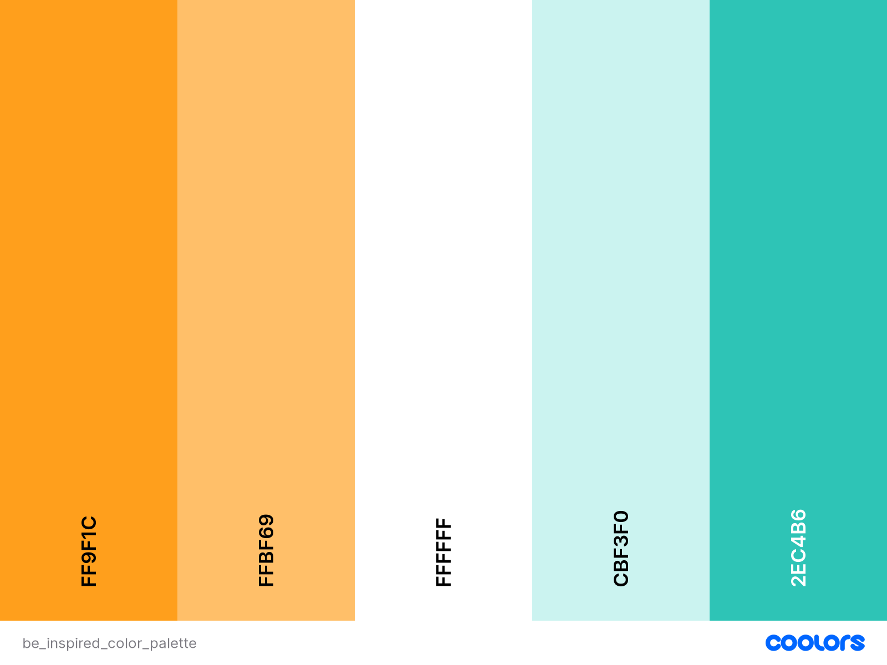

# Welcome to **[Be Inspired (PP5 CI)](https://be-inspired-pp5-ci.herokuapp.com/)**

## PERSPECTIVE
To be inspired and to spread positivity around..

## Links to Repositories and Live Sites

[Live site for the Front End](https://be-inspired-pp5-ci.herokuapp.com/)

[Live site for the Back End](https://be-inspired-drf-api.herokuapp.com/)

[Back End Respository](https://github.com/RoshnaVakkeel/be-inspired-drf-api)

## [Contents](#contents)
- [User Experience (UX)](#user-experience-ux)
	- [Site Goals](#site-goals)
	- [User Personas](#user-personas)
	- [Scope](#scope)
- [Agile Methodology](<#agile-methodology>)
    - [Epics and User Stories](<#epics-and-user-stories>)
        - [Website UI](<#website-ui>)
        - [Authentication](<#authentication>)
		- [Main page Layout](<#main-page-layout>)
		- [Post Management](<#post-management>)
        - [Recommendation Management](<#recommendation-management>)
        - [Comment Management](<#comment-management>)
        - [Likes Management](<#likes-management>)
        - [Profile Management](<#profile-management>)
    - [Acceptance Criteria](<#acceptance-criteria>)
	- [Tasks](<#tasks>)
	- [User Story Management](<#user-story-management>)
        - [Sprints](#sprints)
- [Design](<#design>)
	- [Colours](<#colours>)
	- [Typography](<#typography>)
	- [Imagery](<#imagery>)
	- [Wireframes](<#wireframes>)
- [Features](<#features>)
- [Components](<#components>)
- [Technologies](<#technologies>)
	- [Languages Used](<#languages-used>)
	- [Tools](<tools>)
	- [Frameworks, Libraries and Programs](<#frameworks-libraries-and-programs>)
- [Production](#production)
	- [React](<#react>)
- [Testing](<#testing>)
	- [User Story Testing](<#user-story-testing>)
	- [Testing Technologies](<#testing-technologies>)
		- [Manual Testing](<#manual-testing>)
		- [Validation](<#validation>)
- [Issues and Fixes](<#issues-and-fixes>)
- [Deployment](<#deployment>)
	- [Heroku](<#heroku>)
- [Credits and Resources](<#credits-and-resources>)
	- [Code](<#code>)
	- [Learning Resources](<#learning-resources>)
	- [Content](<#content>)
	- [Media](<#media>)
- [Acknowledgements](<#acknowledgements>)

## User Experience (UX)

### Site Goals
- "Be Inspired" is a social media App mainly meant for everyone who is looking to socialize and share their positive and inspirational thoughts with others.
- Basic goal is to uplift morale and provide users with a happy mood.
- The main motto is - "be the light that lightens up the way for someone else".
- To enable users to share photos, their inspiration and recommendations
- To enable users to network using this social media platform
- All users who sign up and sign in, can access all the features of the website and can create, edit, and delete their posts/recommendations.
- People can post about their inspirations and also can recommend others about the inspirations that helped them.

### User Personas
As mentioned in Site Goals, the users expected to be visiting this website regularly are going anyone seekingg positive motivation or inspiration to tackle/take on challenges in their lives. I created 4 fictional characters which represents the target users. The user personas with their needs, goals and frustrations are enlisted, which helped me design this website with a point of view of distinct users.
The link to User Personas can be found [here](docs/agile/user_personas.pdf).

### Scope

- An attractive and intuitive UX experience: 
	1. Website title that gives an idea what is it about
	2. Hero-image with information on the site's purpose
	3. Responsive design across all devices
	4. A clear and straightforward layout
	5. Footer fixed at the bottom with links to social media only in landing page
	6. Implement alert messages to provide users with more feedback after they take certain actions
	7. Fast application that is easy to use
	8. Show user's profile image in the profile section

- An easy navigation for the user through all the pages and features
	1. Navigation Menu with easy access to all links.
	2. Easy Sign Up/ Sign In/ Sign Out functionality visible.
	3. Posts list with infinite scroll feature
	4. Landing page with guidance to sign up/sign in and how to start using the websites features
	6. Search field to enable user to search a keyword
	7. Category filter for easy sorting of posts / recommendations
	8. User's Feed page with posts and recommendations from their favourite users
	9. Liked page to enable users to save the posts they liked

- Posts and Recommendation Features
	1. Latest entries feature on top or first
	2. On a click they can view post/ recommendation details
	3. Ability to comment on posts / recommendations
	4. Create, Edit and Delete posts and recommendations

- Profiles Features
	1. Shows username and Avatar, enlists posts and recommendations made by the user
	2. Shows information on Followers and other users following
	3. Password change option
	4. Profile edit option

[Back to top ⇧](#contents)

## Agile Methodology
Throughout this project, an agile approach was taken in order to develop the website  Each activity was broken down into  manageable actions from initially creating 4 Epics, which were then broken down into smaller User Stories. Each of the user stories then had different acceptance criteria. The status, comments and details of each Epic along with the associated User Stories can be found in the kanban board linked [here](https://github.com/users/RoshnaVakkeel/projects/3). This made the overall project much more manageable to build. 

## Epics and User Stories
8 Epics were created which were further developed into 37 User Stories. The initial conception was done using google sheets. The link can be found [here](docs/agile/epics_and_user_stories_list_be_inspired.xlsx).

### [Website UI](https://github.com/RoshnaVakkeel/be-inspired-pp5-ci/issues/1)

**Epic Goals for End User**

1. A landing page that describes the purpose of the website
2. User guidance to get started 
3. An easy to use navigation 
4. Easy register/sign up and sign in options
5. Home page with posts list with infinite scroll  visible to all

**Related User Stories**
1. [USER STORY US01: Intuitive Landing Page](https://github.com/RoshnaVakkeel/be-inspired-pp5-ci/issues/2)
2. [USER STORY US02: User Guidance to get started](https://github.com/RoshnaVakkeel/be-inspired-pp5-ci/issues/3)
3. [USER STORY US03: Easy navigation features](https://github.com/RoshnaVakkeel/be-inspired-pp5-ci/issues/4)
4. [USER STORY US04: User Registration/Sign Up Link](https://github.com/RoshnaVakkeel/be-inspired-pp5-ci/issues/5)
5. [USER STORY US05:   Home page with posts list with infinite scroll  visible to all](https://github.com/RoshnaVakkeel/be-inspired-pp5-ci/issues/6)

### [Authentication](https://github.com/RoshnaVakkeel/be-inspired-pp5-ci/issues/8)

**Epic Goals for End User**

Access to
1. Sign Up and Sign In Features
2.  various features on signing in 
3. Sign Out option
4. Access tokens

**Related User Stories**
[US06](https://github.com/RoshnaVakkeel/be-inspired-pp5-ci/issues/7)
[US07](https://github.com/RoshnaVakkeel/be-inspired-pp5-ci/issues/9)
[US08](https://github.com/RoshnaVakkeel/be-inspired-pp5-ci/issues/10)
[US09](https://github.com/RoshnaVakkeel/be-inspired-pp5-ci/issues/11)

### [Main page Layout](https://github.com/RoshnaVakkeel/be-inspired-pp5-ci/issues/12)

**Epic Goals for End User**

This layout will feature:
1. Posts section
2. Creation Section
3. Search Bar
4. Category Filters
5. User Following Section

**Related User Stories**
US10- US16
[US10](https://github.com/RoshnaVakkeel/be-inspired-pp5-ci/issues/13)
[US11](https://github.com/RoshnaVakkeel/be-inspired-pp5-ci/issues/14)
[US12](https://github.com/RoshnaVakkeel/be-inspired-pp5-ci/issues/15)
[US14](https://github.com/RoshnaVakkeel/be-inspired-pp5-ci/issues/16)
[US15](https://github.com/RoshnaVakkeel/be-inspired-pp5-ci/issues/35)
[US16](https://github.com/RoshnaVakkeel/be-inspired-pp5-ci/issues/17)

### [Post Management](https://github.com/RoshnaVakkeel/be-inspired-pp5-ci/issues/18)

**Epic Goals for End User**

1. Post visibility
2. Post Details visibility
3. Post Creation Option
4. Post update Option
5. Post Delete Option

**Related User Stories**
[US17](https://github.com/RoshnaVakkeel/be-inspired-pp5-ci/issues/19)
[US18](https://github.com/RoshnaVakkeel/be-inspired-pp5-ci/issues/20)
[US19](https://github.com/RoshnaVakkeel/be-inspired-pp5-ci/issues/21)
[US20](https://github.com/RoshnaVakkeel/be-inspired-pp5-ci/issues/22)
[US21](https://github.com/RoshnaVakkeel/be-inspired-pp5-ci/issues/23)

### [Recommendation Management](https://github.com/RoshnaVakkeel/be-inspired-pp5-ci/issues/24)
**Epic Goals for End User**

1. Recommendation visibility
2. Recommendation Details visibility
3. Recommendation Creation Option
4. Recommendation update Option
5. Recommendation Delete Option

**Related User Stories**
[US22](https://github.com/RoshnaVakkeel/be-inspired-pp5-ci/issues/25)
[US23](https://github.com/RoshnaVakkeel/be-inspired-pp5-ci/issues/26)
[US24](https://github.com/RoshnaVakkeel/be-inspired-pp5-ci/issues/27)
[US25](https://github.com/RoshnaVakkeel/be-inspired-pp5-ci/issues/28)
[US26](https://github.com/RoshnaVakkeel/be-inspired-pp5-ci/issues/29)

### [Comment Management](https://github.com/RoshnaVakkeel/be-inspired-pp5-ci/issues/30)
**Epic Goals for End User**

1. Comments visibility
2. Comments Creation Option
3. Comments update Option
4. Comments Delete Option

**Related User Stories**
[US27](https://github.com/RoshnaVakkeel/be-inspired-pp5-ci/issues/31)
[US28](https://github.com/RoshnaVakkeel/be-inspired-pp5-ci/issues/32)
[US29](https://github.com/RoshnaVakkeel/be-inspired-pp5-ci/issues/33)
[US30](https://github.com/RoshnaVakkeel/be-inspired-pp5-ci/issues/34)

### [Likes Management](https://github.com/RoshnaVakkeel/be-inspired-pp5-ci/issues/36)

**Epic Goals for End User**

1. Like visibility
2. Like a post/recommendation
3. Unlike a post/recommendation

**Related User Stories**
[US31](https://github.com/RoshnaVakkeel/be-inspired-pp5-ci/issues/37)
[US32](https://github.com/RoshnaVakkeel/be-inspired-pp5-ci/issues/38)
[US33](https://github.com/RoshnaVakkeel/be-inspired-pp5-ci/issues/39)

### [Profile Management](https://github.com/RoshnaVakkeel/be-inspired-pp5-ci/issues/40)

**Epic Goals for End User**

1. Profile visibility
2. Profile creation option
3.  Profile update option
4. Profile popularity assessment

**Related User Stories**
[US34](https://github.com/RoshnaVakkeel/be-inspired-pp5-ci/issues/41)
[US35](https://github.com/RoshnaVakkeel/be-inspired-pp5-ci/issues/42)
[US36](https://github.com/RoshnaVakkeel/be-inspired-pp5-ci/issues/43)
[US37](https://github.com/RoshnaVakkeel/be-inspired-pp5-ci/issues/44)

## Acceptance Criteria
For all the User Stories, Acceptance Criteria were enlisted. The purpose of this was to provide a reference point for the developmental steps. I made sure to cross-check that all the required steps intended was implemented. It also helped with Testing to make sure that all the necessary aspects and features were covered. The acceptance criteria is described on the column next to the user stories (column H) [here](docs/agile/epics_and_user_stories_list_be_inspired.xlsx).

### Tasks
The tasks for the website development process was closely followed as mentioned in CI's Advanced Frontend React module "I Moments" walkthrough project. The task is generally the developers step towards preparing the app.
The tasks that I have followed during the development phase were carried out in this order.

**Before Project Inception**

- Design Entity Relationship Diagram 
- Set up and create  Back End API. For this backend was built using the Django Rest API framework. All information can be found in [BE INSPIRED - DRF API](https://github.com/RoshnaVakkeel/be-inspired-drf-api)

- Create Frontend Repository in GitHub
- Create Project, Epics, User Stories and prepare Kanban Board

**Creation of Project in GitPod**

- Set up ReactJS project

### User Story Management

#### Sprints
The project was divided mainly into three main sprints spanning a week.

- **Sprint 1** was to set up Backend be-inspired-drf-api.

- **Sprint 2** was to set up Frontend ReactJS app and connect with backend API (Faced tough challenges, details in Errors and Fix section)
	- Set up axios interceptors, create async handles and connect to backend.
	- Set up Sign Up and Sign In pages
	- Make forms in fronend, input data and push data into be-inspired-drf-api
	- Pull and show data from be-inspired-drf-api

- **Sprint 3** was to set up Frontend ReactJS app pages, styling, functions and fixing bugs and testing.

[Back to top ⇧](#contents)

## Design

### Colours
- The colour scheme has considered based on easy accessibility for all. 
- Complimentarity was key feature in color selection, to give it a pleasant feel for all age groups.
- The colors have been rendered differently for posts and recommendations, so that user can easily distinguish between them.

The palette was generated with inspiration from palettes provided by [Coolers](https://coolors.co/). Simple combinaion of pastel colours were checked and selected. The color palette used is as shown below.

### Typography

Fonts were imported using Google Fonts. Font "Alegreya Sans" was used throughout with a backup of sans-serif. It was chosen for easy readability for users. 

### Imagery

The imagery on the website has been seleced according to the post requirement.
Many images were taken from [Pexels](https://www.pexels.com/).

### Wireframes
The wireframes were generated at the start of the project suing Balsamiq. After referring to different bootstrap templates, pages were divided into the different relevant sections. 
The finished website closely follows wireframes as the designs were adapted during development but overall structure was kept constant. For eg. an additional 'Liked' page was introduced in order to allo the user to save the posts they liked. 

The wireframes can be found in these links: 
[Wireframes for Desktop](docs/wireframes/wireframes_be_inspired_desktop.pdf) 
[Wireframes for Tablet](docs/wireframes/wireframes_be_inspired_tablet.pdf) 
[Wireframes for Mobile](docs/wireframes/wireframes_be_inspired_mobile.pdf)

[Back to top ⇧](#contents)

## Features

## Components
A number of the components created are reusable and were used across the website in multiple pages and sections.

- `<Asset />` - Asset.js - renders a loading spinner. It is utilized in several places across the site, including showing a loading spinner where API calls are made.
- `<Avatar />` - Avatar.js - displays a user's profile image. It is used in the Create Panel along with the Username. Passed props allow for setting image source and size and adjust image dimensions depending on where the component is rendered.
- `<DropdownMenu />` - DropdownMenu.js - reusable component, used to render the dropdown menu which allows user to edit or delete their own posts/recommendations or comments, and also edit their profile or change profile password. provides a dropdown menu with some additional actions a user can take, such as editing and deleting. 
- `<FeedbackMsg />` - Feedbackmsg.js- component to display feedback messages to the user upon deleting comments, post, and recommendation.
- `<LandingPage />` - LandingPage.js - specific component for displaying a landing page for new / not logged-in users, which contains links to sign up and Sign in, in addition to the navbar.
- `<NavBar />` - NavBar.js-  reusable component with the content depending on the login status of the user. For logged in user it shows Home, Recommendations, Feed and Liked and Sign Out Nav items. For those who are not logged in, it displays icon links to sign up or sign in. The component is used on each page of the app.
- `<PageNotFound />` - PageNotFound.js - specific component to display 404 error message for the url which does not exist.
- `<PopularProfiles />` - PopularProfiles.js - reusable component showing most followed profiles in the app named as "Active Inspirers". The component displays user avatar, name and follow/unfollow button.

## Technologies

### Languages Used
- [CSS](https://en.wikipedia.org/wiki/CSS)
- [HTML5](https://en.wikipedia.org/wiki/HTML5)
- [JavaScript](https://en.wikipedia.org/wiki/JavaScript)
- [React JSX](https://reactjs.org/docs/introducing-jsx.html)

### Tools

- [Balsamiq](https://balsamiq.com/)- to create the wireframes for the project
- [Chrome dev tools](https://developers.google.com/web/tools/chrome-devtools/) - for debugging of the code and checking site responsiveness
- [LICEcap](https://www.cockos.com/licecap/) - to generate gif files for testing all the features of the app
- [Cloudinary](https://cloudinary.com/) - to store static files
- [Coolors](https://coolors.co/?home) - for color palette
- [Favicon.io](https://favicon.io) - to generate the site favicon
- [Font Awesome](https://fontawesome.com/) - Icons from Font Awesome, used in NavBar and create buttons, like and comment icons
- [Google Fonts](https://fonts.google.com/) - import font
- [Git](https://git-scm.com/) - for version control within VSCode to push the code to GitHub
- [GitHub](https://github.com/) - for remote repository to store project code
- [Gitpod](https://gitpod.io) - to host a virtual workspace
- Validation:
  - [WC3 Validator](https://validator.w3.org/) was used to validate the html
  - [Jigsaw W3 Validator](https://jigsaw.w3.org/css-validator/) was used to validate the css
  - [ESLint](https://eslint.org/) used to validate JSX code

### Frameworks, Libraries and Programs

**Frameworks and Libraries **
- [React Bootstrap4](https://react-bootstrap-v4.netlify.app/) - for styling the site and site responsiveness across various devices
- [ReactJS](https://reactjs.org/) - to build the functionality of the site
- [Font Awesome](https://fontawesome.com/) - to add various icons to the site
- [Axios](https://axios-http.com/docs/intro) - used for promise-based HTTP. axios was used to send API requests from the React project to the be_inspired_drf_api and avoid any CORS errors when sending cookies.
- [JWT](https://jwt.io/) - library to decode out JSON Web token. JWT prevents unauthenticated user from making extra network requests to refresh their access token. It is also used to remove the timestamp from the browser when the user refreshes token expires or the user logs out.
- [Popper](https://popper.js.org/) - a 3rd party library used by React-Bootstrap to make sure the dropdown menus position is fixed on all browsers.
- [React Infinite Scroll](https://www.npmjs.com/package/react-infinite-scroll-component) - to enable component to load content (posts, recommendations and comments) automatically as the user scrolls towards the bottom of the page without having to jump to next/previous page.
- [React Router](https://v5.reactrouter.com/web/guides/quick-start) - used for dynamic routing. This library enables the navigation among views of various components and control what the user can see depending on the URL they have accessed in the browser.

[Back to top ⇧](#contents)

## Production

Installations:
- React library - using the command `npx create-react-app . --template git+https://github.com/Code-Institute-Org/cra-template-moments.git --use-npm`
For the React project set up
- react-bootstrap - using the command `npm install react-bootstrap@1.6.3 bootstrap@4.6.0`
This is used to render the layout and styling of the website. The library makes it easy to create and use standard interface elements that are responsive.
- react-router-dom - using the command `npm install react-router-dom@5.3.0`
 This library makes the site navigation easier without the need to refresh the page. In social media sites ith mutiple components, it provides a quick and responsive user experience.
- axios - installed using command `npm install axios`.It manages the calls to the backend database. Simplifies the API requestsand the included interceptors refresh JSON Web Tokens which the site uses.
- infinite-scroll-component - installed using command ` npm install react-infinite-scroll-component`.
It is used to enable infinite scrolling on the Posts and Recommendations components and on comments. Infinite scrolling is a standard feature in all social media sites.
- jwt decode - Using command `npm install jwt-decode`. Used to remove requests to refresh an access token for signed out users. It enables the refresh token to be decoded so that a timestamp can be put in local storage, if a timestamp does not exist in the user's local storage then access refresh requests will not be made.

## Testing

### User Story Testing

### Testing Technologies

#### Manual Testing
I manually tested all the features of the website making sure to go through them with different browsers and device sizes. I also checked the features of the site against the original user stories and compared them with the acceptance Criteria. All the tests were recorded using LICEcap tool.

CRUD functionality has been tested for the following: Posts, Reviews, Events, Comments, Likes, Follows and Profile on both the development and deployed version of the site
All Nav links open on the correct page
All external links open in a new browser
Authentication works displaying a different set of options for logged-in users compared to logged-out
Pages that are intended for logged-in users only will redirect any users who are not logged in back to the homepage
Validation on forms works
Not found pages display correctly when a non-existent URL is searched or a Post, Review or Event that doesn't exist is searched
All pages are mobile responsive
#### Validation
